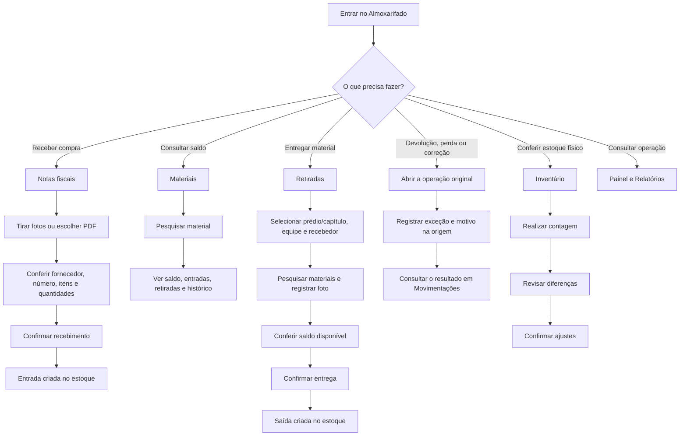

# Manual operacional do Almoxarifado

## Objetivo

Orientar o funcionário a receber, consultar, entregar e conferir materiais usando um único caminho para cada operação.

## Sequência das abas

### Operação

1. `Notas fiscais` — receber materiais.
2. `Materiais` — consultar saldo e histórico.
3. `Retiradas` — entregar materiais; substituirá o nome `Requisições`.
4. `Movimentações` — consultar o extrato imutável das operações.
5. `Inventário` — conferir o estoque físico.
6. `Equipamentos` — controlar patrimônio e termos de responsabilidade.

### Gestão

7. `Painel` — acompanhar alertas e indicadores.
8. `Relatórios` — consultar e exportar informações.

## Fluxograma

## Procedimento 1 — Receber material

1. Abrir `Notas fiscais`.
2. Selecionar `Tirar fotos` no celular ou `Escolher arquivo/PDF`.
3. Fotografar todas as páginas com boa iluminação, sem cortar bordas e sem inclinação.
4. Aguardar a leitura automática.
5. Conferir obrigatoriamente:
   - fornecedor e CNPJ;
   - número e data do documento;
   - descrição de cada material;
   - quantidade e unidade;
   - valor unitário e total;
   - grupo de compra.
   - vínculo com o insumo previsto ou justificativa de material não previsto.
6. Corrigir os dados identificados incorretamente.
7. Se o sistema indicar duplicidade, abrir o lançamento existente e não confirmar uma nova entrada.
8. Selecionar `Confirmar recebimento` somente depois da conferência física.
9. Verificar se a nota aparece em `Lançadas no estoque` e se o movimento de entrada foi criado.

Resultado esperado: a entrada aparece uma única vez, vinculada ao documento e ao usuário autenticado.

## Procedimento 2 — Consultar material

1. Abrir `Materiais`.
2. Pesquisar pelo código ou por parte da descrição.
3. Conferir `Saldo disponível`, `Recebido`, `Retirado` e `Última movimentação`.
4. Abrir o histórico quando precisar identificar a origem de uma entrada ou o destino de uma retirada.
5. Não usar exclusão para corrigir cadastro com histórico; solicitar arquivamento ou estorno.

## Procedimento 3 — Entregar material

1. Abrir `Retiradas`.
2. Selecionar `Nova retirada`.
3. Selecionar o prédio/capítulo principal do orçamento e a equipe.
4. Informar quem recebeu o material.
5. Adicionar os materiais e informar as quantidades.
6. Conferir o saldo disponível mostrado pelo sistema.
7. Coletar a assinatura de quem recebeu e registrar ao menos uma foto da entrega.
8. Revisar o resumo com saldo anterior, quantidade entregue e saldo posterior.
9. Selecionar `Entregar e baixar estoque` uma única vez.
10. Conferir o número do comprovante e o movimento de saída gerado.

Resultado esperado: a saída fica ligada à retirada, ao prédio/capítulo, à equipe, ao recebedor e ao operador autenticado.

## Procedimento 4 — Registrar exceção

`Movimentações` não possui formulário de cadastro. Ela mostra tudo que alterou o estoque. Para registrar uma exceção, comece na tela de origem:

- devolução ao estoque;
- perda ou avaria;
- estorno;
- correção extraordinária autorizada.

Procedimento:

1. Abrir a retirada original para uma devolução.
2. Abrir o material para registrar perda ou avaria.
3. Abrir a nota, retirada ou inventário original para solicitar estorno.
4. Informar o motivo e anexar evidência quando aplicável.
5. Conferir o impacto antes de confirmar.
6. Consultar o resultado em `Movimentações`; nunca excluir o movimento original.

## Procedimento 5 — Realizar inventário

1. Definir previamente o grupo ou local que será contado.
2. Abrir `Inventário` e iniciar uma sessão de contagem.
3. Contar fisicamente sem usar o saldo do sistema como resposta.
4. Informar a quantidade encontrada.
5. Revisar a lista de divergências.
6. Recontar diferenças relevantes.
7. Confirmar os ajustes somente após a revisão administrativa exigida.
8. Guardar o número da sessão e o relatório de diferenças.

## Diferença entre as áreas

| Área | Finalidade | Efeito normal no saldo |
|---|---|---:|
| Notas fiscais | Receber compras | Aumenta |
| Materiais | Consultar a posição atual | Nenhum |
| Retiradas | Entregar material | Reduz |
| Movimentações | Histórico imutável das operações | Nenhum pela própria aba |
| Inventário | Conciliar físico e sistema | Ajusta após confirmação |

## Checklist diário do funcionário

### Início do expediente

- [ ] Confirmar a obra selecionada.
- [ ] Verificar documentos ou recebimentos do dia.
- [ ] Verificar entregas de materiais previstas.
- [ ] Conferir alertas de estoque baixo.

### A cada recebimento

- [ ] Fotografar ou anexar o documento completo.
- [ ] Conferir os materiais fisicamente.
- [ ] Conferir descrição, quantidade, unidade e valor.
- [ ] Confirmar que não é duplicidade.
- [ ] Confirmar a entrada somente uma vez.

### A cada entrega

- [ ] Identificar quem recebeu.
- [ ] Informar frente de serviço e tarefa/EAP.
- [ ] Conferir saldo disponível.
- [ ] Registrar todos os itens e quantidades.
- [ ] Obter a confirmação do recebedor.
- [ ] Conferir o comprovante gerado.

### Final do expediente

- [ ] Conferir movimentos sem origem ou justificativa.
- [ ] Verificar perdas, devoluções ou estornos do dia.
- [ ] Confirmar que nenhum recebimento ou entrega ficou incompleto.
- [ ] Comunicar divergências ao gestor.

## Situações que exigem o gestor

- saldo insuficiente para uma retirada;
- documento possivelmente duplicado;
- perda ou avaria;
- necessidade de estorno;
- diferença relevante no inventário;
- correção extraordinária;
- material com histórico que precisa ser arquivado.
